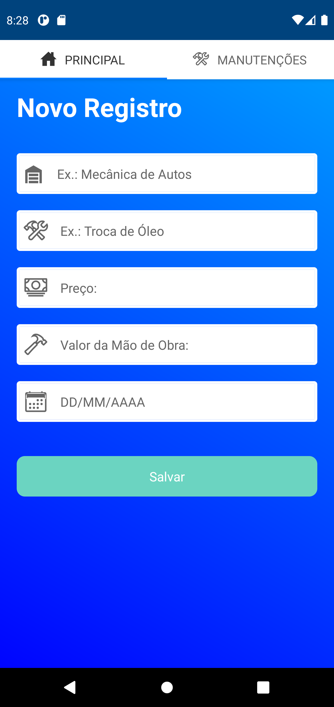
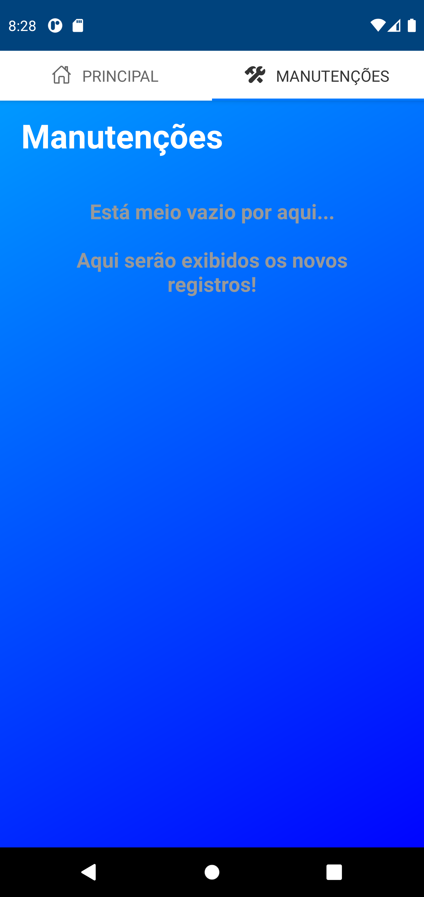
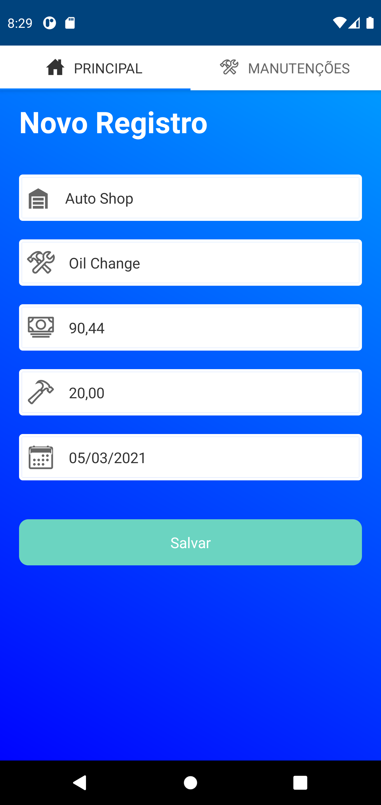
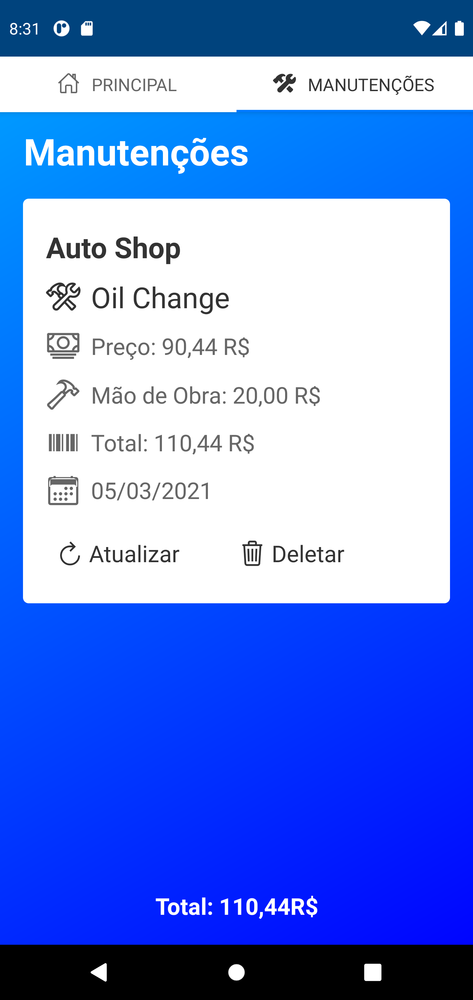
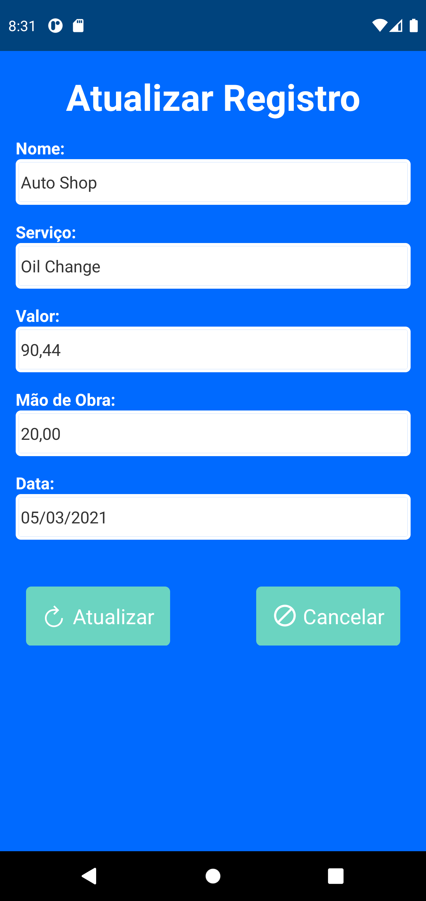

# App My Car :car:
## Basic app to save vehicle maintenances and keep track on how much was spent.

:white_check_mark: Content Table
===============================

<!--ts-->  
* [Content Table](#white_check_mark-content-table)
* [About](#bulb-about)
* [installation](#gear-installation)
* [How To Use](#computer-how-to-use)
* [Technologies](#hammer_and_wrench-technologies)    
 <!--te-->

## :bulb: About 
The ideia of this project came from a problem that my mother was dealing with: She couldn't track how much money (in total) she was spending with her car maintenances.
So I came up with this simple app, where she can register the name of the auto shop, the service that was made, how much for the parts, how much for the labor and the date.

##  :gear: Installation
Before the installation, be sure that you have your development environment properly set up.  
For that, I recommend you to follow [this tutorial](https://reactnative.dev/docs/environment-setup).
After you set your development environment up, you can continue.
  
**NOTE**: This is a React Native App for ANDROID users. It was never tested in IOS, **it may not run properly in IOS systems**.
  
* Follow the steps bellow to install the project on your machine:
```
1. git clone https://github.com/FernandoOliveeira/app-my-car-realmDB.git
2. cd mycarrealm
```
* Install the dependencies and run the app:
```
3. yarn install
4. react-native run-android
```
or
```
3. npm install
4. react-native run-android
```
## :computer: How To Use
As soon the app is open, the main page will appear and with you swip to the side, you will see the maintenances page (which, for now, still empty): 
<br/>
<p align="center">
  <kbd>
    
  </kbd>
  &nbsp;&nbsp;&nbsp;&nbsp;
  <kbd>
    
  </kbd>
</p>   
 
<br/>
 
In the main page, after you fill all the fields, you can press the "Salvar" button, to save the informations in the database:  
<br/>
<p align="center">
  <kbd>
    
  </kbd>
</p>

<br/>

After you save the informations, you can see, update/delete any record in maintenances page:  
<br/>
<p align="center">
  <kbd>
    
  </kbd>
  &nbsp;&nbsp;&nbsp;&nbsp;
  <kbd>
    
  </kbd>
</p>  

## :hammer_and_wrench: Technologies  
The following tools were used in this project:
 - [React Native](https://reactnative.dev/)
 - [Node.js](https://nodejs.org/en/)


  
